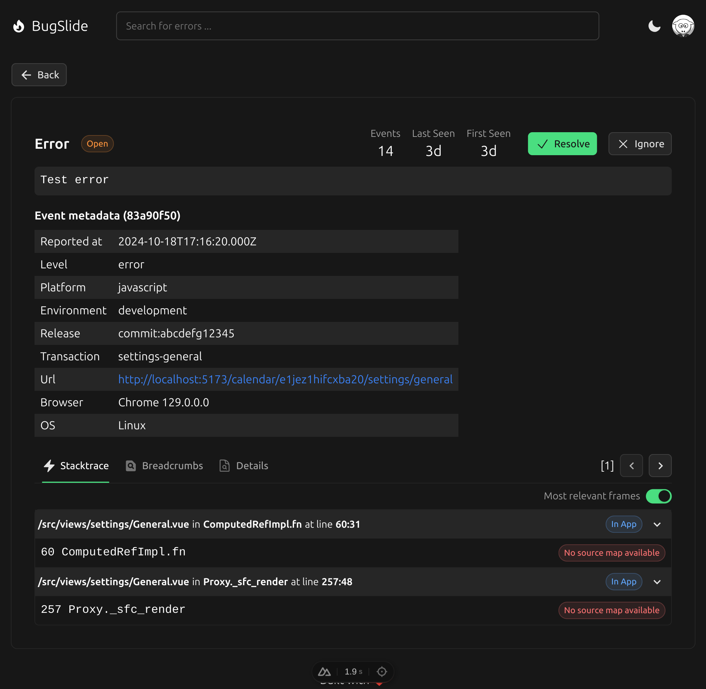
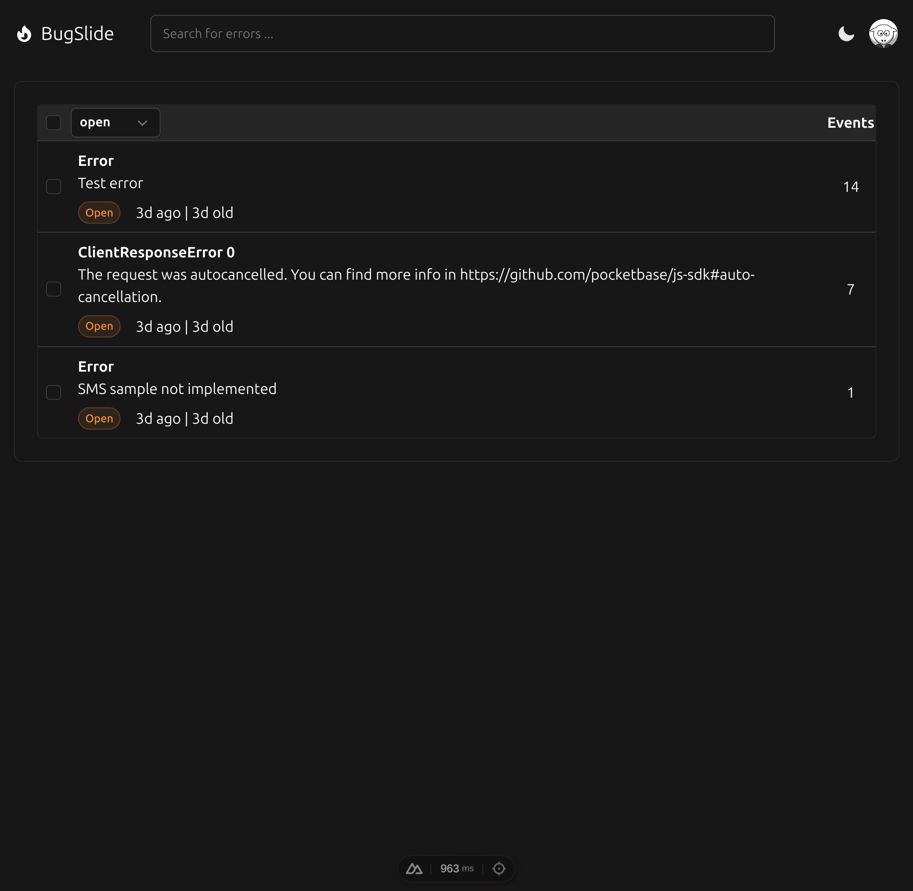

# Bugslide

Simple error tracker that can be used with Sentry-compatible SDKs.
It is designed to be self-hosted and easy to use.

## Features

- Capture errors from Sentry-compatible SDKs
- Analyse errors with stack trace, breadcrumbs and release information
- Receive email alerts when new error is captured





## Setup client (browser)

1. Install dependencies:

```bash
$ npm install --save @sentry/browser
```

2. Setup Sentry client:

```javascript
import * as Sentry from '@sentry/browser';

Sentry.init({
  dsn: 'http://can-be-ignored@localhost:3000/<project-id>',
  environment: 'development',
  release: 'commit:abcdefg12345',
  integrations: [
    Sentry.replayIntegration(),
    Sentry.captureConsoleIntegration({
      levels: ['error'],
    }),
  ],

  logErrors: true,
});

Sentry.captureMessage('Hello, world!');
```

## TODO

- [ ] Fix events counter race-condition when inserting multiple events at once
- [x] Add support for multiple projects
  - [ ] Add new project
  - [ ] Delete project
- [x] Add authentication
  - [x] Login / Register
  - [x] Logout
  - [x] Only return projects that user is assigned to
  - [ ] Assign user to project
- [ ] Source maps
  - [ ] Upload source maps
  - [ ] Show stack trace with source maps
- [x] Add button to resolve, reopen, ignore errors
- [ ] Allow to delete errors
- [x] Releases
  - [ ] Automatically create release when first event is received
  - [ ] Link to open release in forge
  - [ ] Upload source maps
- [ ] Environment
  - [ ] Automatically create environment when first event is received
- [x] Allow filtering by
  - [ ] Environment
  - [ ] Release
  - [x] Status (resolved / unresolved / ignored)
- [ ] Multiedit
  - [ ] Allow ignoring multiple errors at once
  - [ ] Allow resolving multiple errors at once
- [ ] Pagination
  - [ ] Paginate errors
- [ ] rate limiting & quotas
  - [ ] event submission x / minute
  - [ ] delete resolved issues after x days
  - [ ] delete error event data after x days
  - [ ] delete oldest event if limit x is reached
- [x] Alert via email when new issue is created
- [ ] Add first seen / last seen in release ...