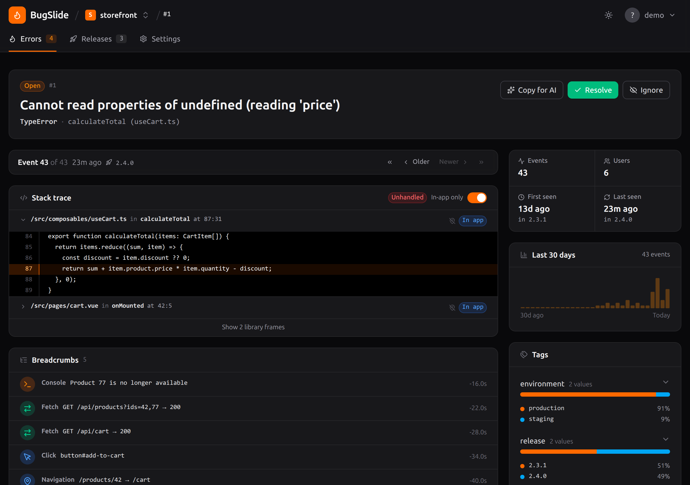
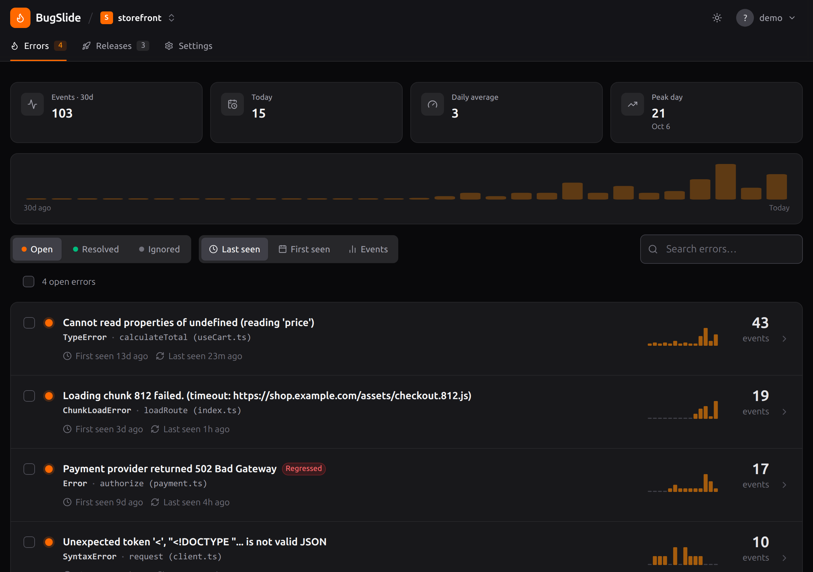

# Bugslide

Simple error tracker that can be used with Sentry-compatible SDKs.
It is designed to be self-hosted and easy to use.

## Features

- Capture errors from Sentry-compatible SDKs
- Analyse errors with stack trace, breadcrumbs and release information
- Receive email alerts when new error is captured
- Source maps, releases and per-release error tracking
- Resolve, reopen and ignore issues with trends, affected users and tag breakdowns
- Copy errors as markdown for AI tools and an MCP server





## Setup client (browser)

1. Install dependencies:

```bash
$ npm install --save @sentry/browser
```

2. Setup Sentry client:

```javascript
import * as Sentry from '@sentry/browser';

Sentry.init({
  dsn: 'http://can-be-ignored@localhost:3000/<project-id>',
  environment: 'development',
  release: 'commit:abcdefg12345',
  integrations: [
    Sentry.replayIntegration(),
    Sentry.captureConsoleIntegration({
      levels: ['error'],
    }),
  ],

  logErrors: true,
});

Sentry.captureMessage('Hello, world!');
```
